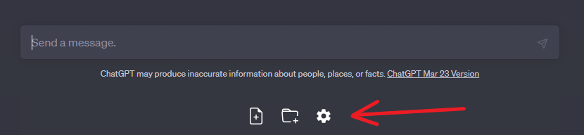

# ChatGPT Uploader

A browser extension that let's you send entire projects to ChatGPT in a couple of clicks.



## Try it now on Chrome

1- Clone the repo and build
```
git clone https://github.com/webNeat/chatgpt-uploader.git
cd chatgpt-uploader
yarn install
yarn build
```

2- Open [`chrome://extensions`](chrome://extensions) and enable developer mode (on the top right corner).

3- Click `Load unpacked extension` and choose the directory `<clonePath>/build/chrome-mv3-prod`

4- Open [`https://chat.openai.com/`](https://chat.openai.com/) and notice the added section under the prompt input
